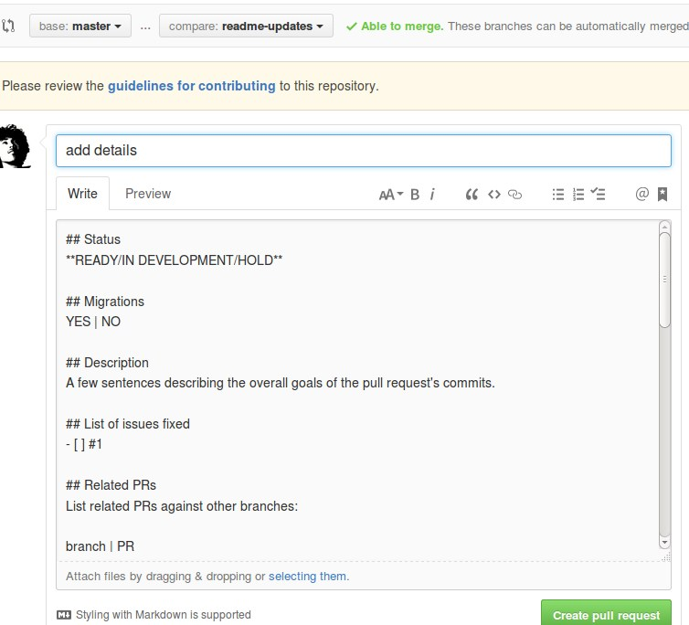

# github-issues-pull-requests-sample
Example of https://github.com/blog/2111-issue-and-pull-request-templates

### Guideline

All you need to do is create three files:
- [CONTRIBUTING.md](.github/CONTRIBUTING.md) - contributing guideline which appears while creating new PR or issue
- [ISSUE_TEMPLATE.md](.github/ISSUE_TEMPLATE.md) - template for new issues
- [PULL_REQUEST_TEMPLATE.md](.github/PULL_REQUEST_TEMPLATE.md) - template for pull request

You can put these three files in the root of your project or if you want a little bit of organization, you can put it inside `.github` directory.

### How they look

#### New Issue

#### Pull Request

